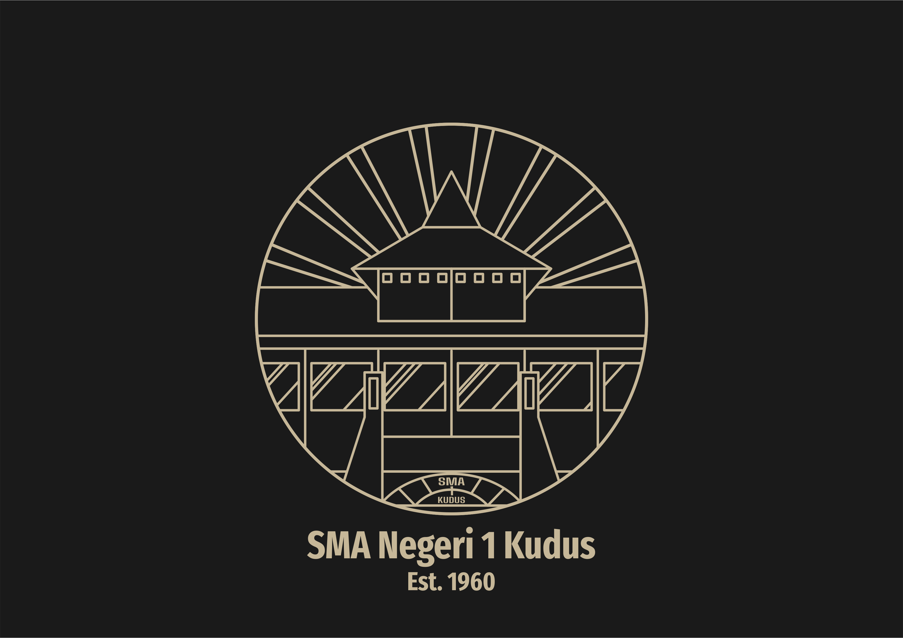
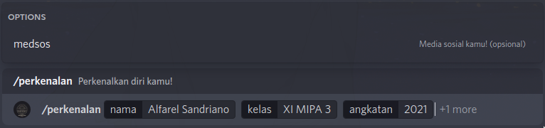
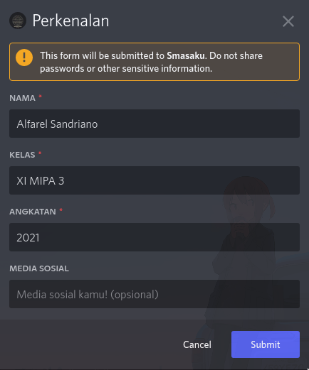

# **Discord-Smasaku**

    

    
    

Discord-Smasaku adalah bot Discord yang dibuat sebagai medium perkenalan anggota server yang baru bergabung dan sebagai otomatisasi dalam penggantian _role_ kelas (akan datang) ketika kenaikan kelas dimulai. 

## bantuan

`/bantuan`

Dapatkan bantuan untuk perintah perkenalan!

## perkenalan-slash

`/perkenalan-slash`

    

## perkenalan (modal)

**Sedang dalam tahap pengerjaan.**

    

